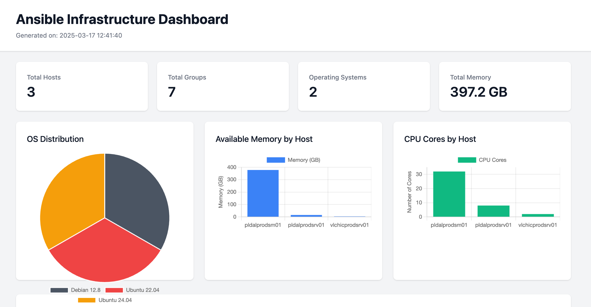
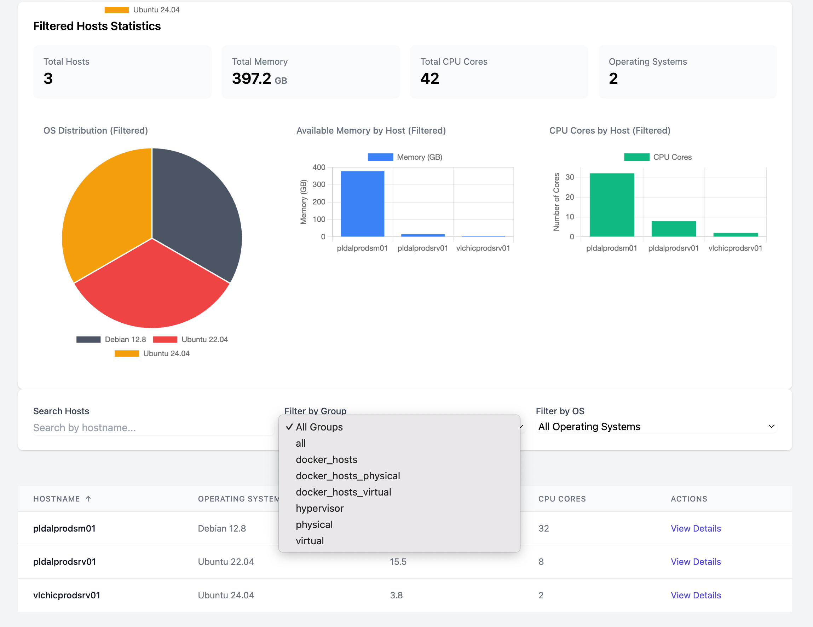
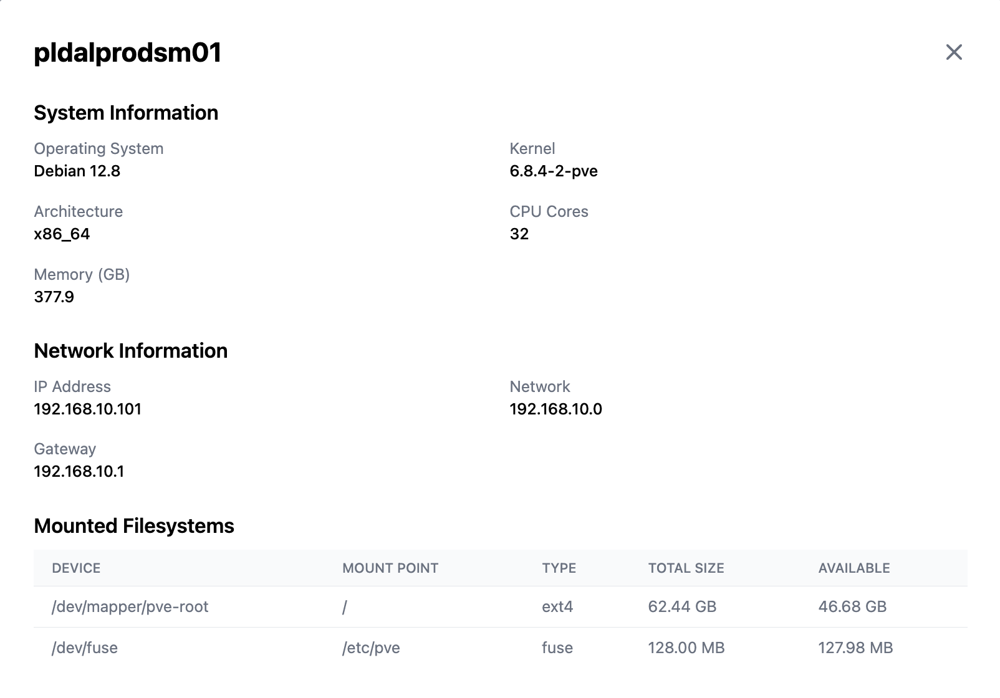

# Ansible Viewer

A lightweight web-based dashboard for visualizing Ansible inventory and facts data. Built with Alpine.js and Tailwind CSS, it provides an interactive interface to explore your Ansible infrastructure.

## Features

- Interactive HTML dashboard with modern UI
- Host information visualization including:
  - System details (OS, Kernel, Architecture)
  - Hardware specs (CPU cores, Memory)
  - Network configuration
  - Mounted filesystems
- Dynamic filtering by:
  - Host groups
  - Operating systems
  - Search queries
- Real-time statistics for filtered hosts
- Interactive charts showing:
  - OS distribution
  - Memory usage
  - CPU cores distribution
- Sortable host table
- Detailed host information in modal dialogs

## Requirements

- Python 3.6+
- Web browser with JavaScript enabled
- Ansible config that will store facts in json file

Example config
```
[defaults]
fact_caching = jsonfile
fact_caching_connection = /path/to/store/facts
fact_caching_timeout = 86400
```
- Collected ansible facts. We can run `gather_facts.yml` to gather facts

## Screenshots





## Installation

1. Clone the repository:
```bash
git clone https://github.com/sulo1337/ansible-viewer.git
cd ansible-viewer
```

2. Install dependencies:
```bash
pip install -r requirements.txt
```

## Usage

1. Prepare your Ansible inventory and facts:
   - Inventory file in YAML format
   - Facts directory containing JSON files (one per host)

2. Generate the dashboard:
```bash
python generate_dashboard.py path/to/inventory path/to/facts output.html
```

3. Open the generated HTML file in your web browser.

## Project Structure

```
ansible-viewer/
├── generate_dashboard.py    # Main script to generate dashboard
├── parser/
│   ├── __init__.py
│   ├── inventory.py        # Inventory parser
│   └── facts.py           # Facts parser
├── templates/
│   └── static_dashboard.html  # Dashboard template
├── example/
│   ├── inventory.yml      # Example inventory
│   └── facts/            # Example facts directory
└── README.md
```

## Development

The project uses:
- Alpine.js for interactivity
- Tailwind CSS for styling
- Chart.js for data visualization
- Jinja2 for template rendering

To modify the dashboard:
1. Edit the template in `templates/static_dashboard.html`
2. Update the Python code in `generate_dashboard.py` or parsers if needed
3. Generate a new dashboard to test changes

## Contributing

1. Fork the repository
2. Create a feature branch
3. Commit your changes
4. Push to the branch
5. Create a Pull Request

## License

[MIT License](LICENSE)
